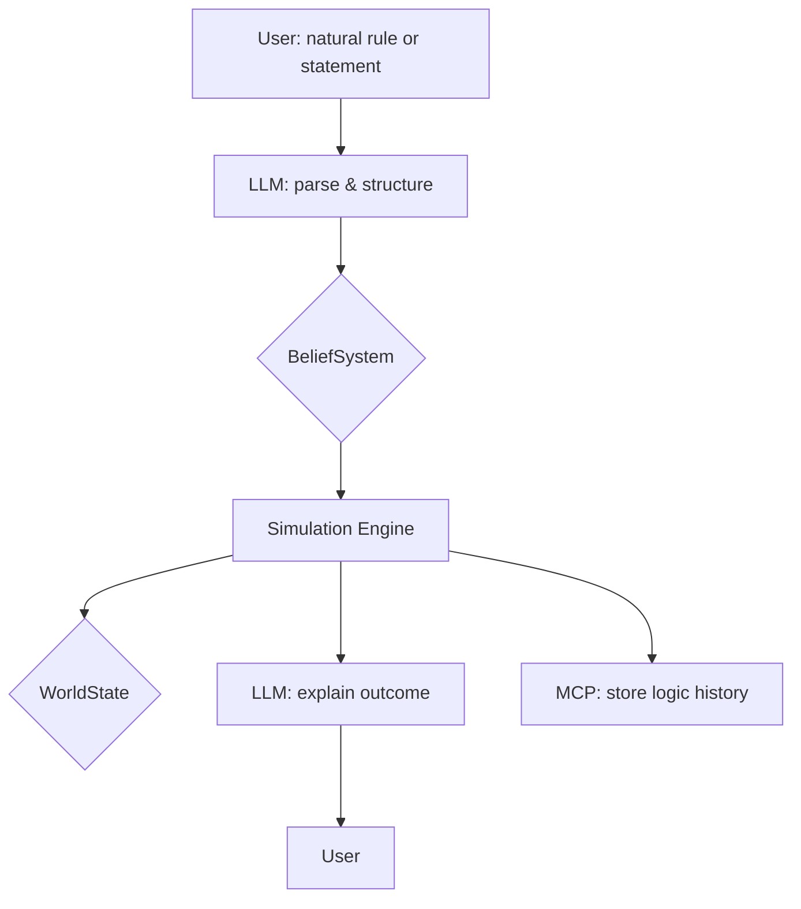

# Logic Fabricator: System Architecture

> \_"This document explains what we’re building, how it’s structured, and where it’s headed — in case you’re a future contributor, a helpful AI, or just someone who got lost in the woods and found a logic engine."

---

## 📦 Overview

Logic Fabricator is a system where users define logic worlds (belief systems) using natural-language rules. These are then used to simulate, evaluate, and mutate logical outcomes based on narrative statements.

The system aims to:

- Let users define flexible, even contradictory logic systems.
- Let AI turn messy natural rules into structured logic.
- Simulate consequences of statements within a belief system.
- Allow for branching and mutation of belief systems over time.

All while keeping it fun, transparent, and user-driven.

---

## 🧱 Key Components

### 1. **Rule**

- User-facing input: natural language.
- Parsed into structured object: verb modifiers, entities, qualifiers.
- **Architectural Constraint**: A Rule's consequence is always a `Statement`. A Rule cannot generate another Rule. This is a deliberate design choice to ensure the logic of a belief system is stable and traceable. It prevents self-modifying logic, which would complicate our goal of creating an understandable and auditable reasoning engine.
- Current status: primitive object holding a text and a basic verb identifier.
- Goal: grow into a modular, evaluatable logic unit with type annotations.

### 2. **Statement**

- Facts or assertions from the user.
- Example: "Alice trusts Ravi"
- Parsed into subject / verb / object triples.
- Evaluated against rules.

### 3. **BeliefSystem**

- A named collection of rules.
- Can be forked, mutated, versioned.
- Handles rule conflict resolution and contradiction policy.
- Think of it like a logic-space Git branch.

### 4. **Simulation Engine**

- The orchestrator of the logic-space.
- Takes a `BeliefSystem` and a `WorldState` as input.
- Runs the inference loop, applying rules from the `BeliefSystem` to its `WorldState`.
- Captures inferred consequences (`Statements` and `Effects`).
- Handles contradictions by forking the `BeliefSystem`.

### 5. **LLM Integration** *(external brain)*

- Turns rule text into structured logic.
- Explains contradictions.
- Suggests alternative rule phrasings or interpretations.

### 6. **MCP (Memory Control Plane)**

- Tracks logic history over time.
- Records:
  - When rules were added or mutated
  - Contradictions and forks
  - Simulation results tied to belief versions
- Think of this as Git meets cognitive memory.

---

## 🧭 Architectural Flow

**Note on Flow**: The diagram shows that the `Simulation Engine` produces a `WorldState`. It is a core principle that this is a one-way flow. The engine's rule evaluation is driven by `Statements` within the `BeliefSystem`, not by changes in the `WorldState`. This ensures a clear and traceable line of logical inference.

---

## ⏳ Current Scope (MVP)

- ✅ Parse Rule and Statement into simple objects
- ✅ Check if Rule applies to Statement (hardcoded logic)
- ✅ Follow TDD for every evolution step
- ✅ Decoupled Simulation Engine
- 🚧 Evaluate belief systems (planned)
- 🚧 Support contradictions and forks
- 🚧 Hook in LLM later

---

## 📌 What We’re *Not* (Yet)

- We are not a full symbolic logic engine.
- We are not a deterministic theorem prover.
- We are not a chatbot. (Though LLMs may assist.)
- We are not enforcing rigid ontologies or type systems.

We *are* creating a creative playground for reasoning — with a backbone.

---

## 🛣️ Evolution Plan (What Comes Next)

1. **Rule Matching Layer**

   - Improve how we detect if a statement falls under a rule.
   - Allow for soft matching (e.g. synonyms, modifiers).

2. **Contradiction Engine**

   - When two rules lead to incompatible conclusions.
   - User decides to fork, override, or mutate.

3. **Simulation Engine**

   - Process multi-statement narratives.
   - Accumulate derived facts.

4. **LLM Hooks**

   - Use GPT or others for parsing rule language.
   - Explain simulation results.

5. **MCP Engine**

   - Track forks, versions, authorship, and logic lineage.

6. **UI / DSL Layer**

   - CLI first, then visual playground.
   - Possibly support a lightweight DSL or natural markup for rules.

---

## 🧪 Dev Guidelines

- Tests drive all design.
- Use minimal hardcoding to satisfy each test.
- Commit after every TDD cycle.
- Refactor only when green.
- Keep edge cases close to the test.

> *"You’re not just writing code. You’re constructing logic space. Be kind to future fabricators."*

